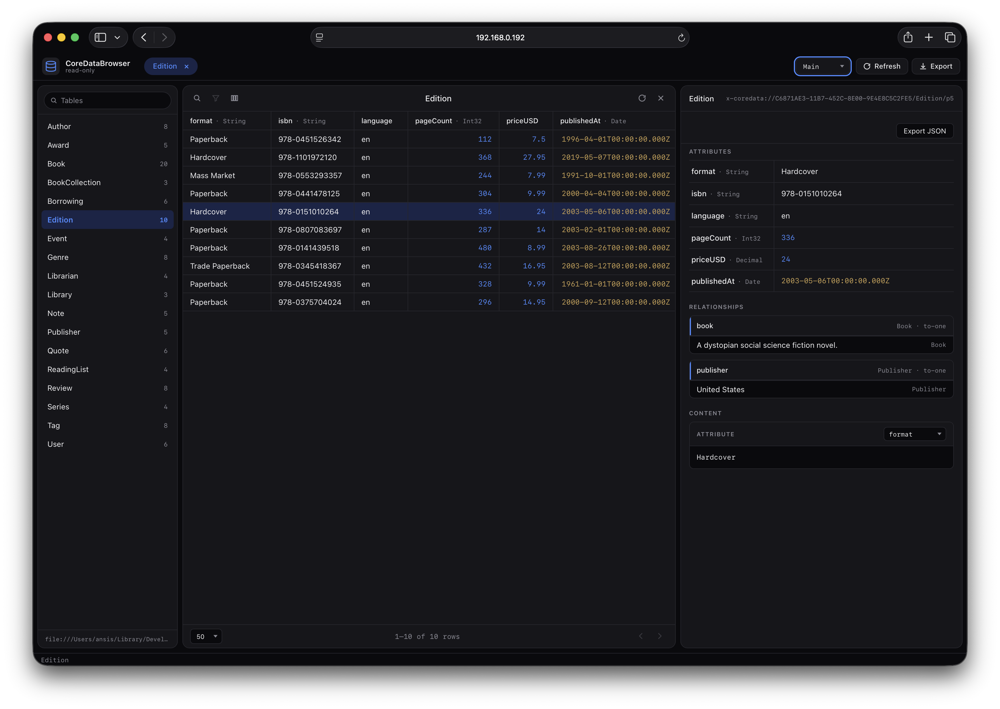

# CoreDataBrowser

A modern, drop-in Core Data inspector for iOS / iPadOS / macOS / tvOS / Mac Catalyst apps. Boots a tiny HTTP server inside your app and exposes the contents of any `NSManagedObjectContext` to a desktop browser on the same local network. Inspired by the original [iOS-Hierarchy-Viewer](https://github.com/damian-kolakowski/iOS-Hierarchy-Viewer), scoped to **Core Data browsing only**.



The bundled web UI: sidebar entity list with search, multi-tab open entities at the top, a center records grid with sortable / resizable / reorderable / hideable columns, and a right-side detail inspector that stacks attributes, relationships, and a content viewer. Pane sizes, column preferences, and open tabs persist in `localStorage`.

- **Read-only by default**; opt in to edit + delete with `Options.readOnly = false`.
- **Manual refresh** — the web UI re-queries on demand.
- **Zero UI changes** in your app — open the URL printed at launch in any browser.
- **Pure Swift Package**, one dependency ([Swifter](https://github.com/httpswift/swifter)).

## Features

Highlights:

- Sidebar entity list with row counts.
- Records grid with sortable / resizable / reorderable / hideable columns; preferences persisted in `localStorage` per entity.
- Per-record detail inspector — every attribute, plus a relationships summary with clickable items (browser back button works).
- Relationships sub-panel — pick a relationship of the selected row from a dropdown, click an item to navigate.
- Content viewer — pick an attribute of the selected row to read its full value.
- Multiple `NSManagedObjectContext` support — register many in one server; the top bar shows a context switcher when there's more than one.
- Manual refresh; pane sizes persisted across reloads.
- Edit mode (opt-in): edit attribute values, delete records, upload binary blobs up to 10 MB. Relationships stay read-only. Disabled by default — writes return `405` until `Options.readOnly = false`.

Routes: the UI is served at `/` (and aliased at `/lab` / `/index.html` so old links keep working).

## Requirements

- iOS 15+ / iPadOS 15+ / macOS 12+ / tvOS 15+ / Mac Catalyst 15+
- Swift 5.9+
- A Core Data `NSManagedObjectContext` (`viewContext` or a private-queue context)
- Local Wi-Fi between the device and the machine running the desktop browser

## Installation

### Xcode (recommended)

1. **File → Add Package Dependencies…**
2. Paste the package URL, e.g. `https://github.com/<you>/CoreDataBrowser.git`, or pick **Add Local…** and select the `CoreDataBrowser/` folder.
3. Add the `CoreDataBrowser` library to your app target.

### `Package.swift`

```swift
dependencies: [
    .package(url: "https://github.com/<you>/CoreDataBrowser.git", from: "1.0.0")
],
targets: [
    .target(name: "MyApp", dependencies: ["CoreDataBrowser"])
]
```

### Local package

Reference the package from any consuming iOS app project via an absolute or relative path. From `Package.swift`:

```swift
dependencies: [
    .package(path: "/Users/<you>/iOS/CoreDataBrowser")
]
```

Or in Xcode: **File → Add Package Dependencies… → Add Local…** and select the `CoreDataBrowser` folder. Xcode writes the path as an `XCLocalSwiftPackageReference` in the consuming app's `.xcodeproj` and rebuilds the package as a sibling target.

## Quick start

```swift
import SwiftUI
import CoreData
import CoreDataBrowser

@main
struct MyApp: App {
    let persistence = PersistenceController.shared

    #if DEBUG
    private let browser: CoreDataBrowserServer
    @State private var browserURLs: [URL] = []

    init() {
        browser = CoreDataBrowserServer(context: persistence.container.viewContext)
    }
    #endif

    var body: some Scene {
        WindowGroup {
            ContentView()
                #if DEBUG
                .onAppear {
                    do {
                        let info = try browser.start()
                        browserURLs = info.urls
                        info.urls.forEach { print("CoreDataBrowser:", $0.absoluteString) }
                    } catch {
                        print("CoreDataBrowser failed to start:", error)
                    }
                }
                #endif
        }
    }
}
```

Console output on launch:

```
CoreDataBrowser: http://192.168.1.42:8080
CoreDataBrowser: http://127.0.0.1:8080
```

Open either URL from a desktop browser on the same network — the LAN address from another machine, `127.0.0.1` from the same machine (which works for the iOS Simulator since it shares the host's network stack).

## Configuration

```swift
var opts = CoreDataBrowserServer.Options()
opts.port = 9000              // base port; +1…+10 retried if busy
opts.bindAddress = .loopback  // only reachable from the device itself
let server = CoreDataBrowserServer(context: ctx, options: opts)
```

| Option | Default | Description |
|---|---|---|
| `port` | `8080` | Preferred port. If busy, `port+1 … port+10` is tried. |
| `bindAddress` | `.allInterfaces` | `.allInterfaces` (`0.0.0.0`) or `.loopback` (`127.0.0.1` only). |
| `readOnly` | `true` | When `true`, `PATCH`/`DELETE` return `405`. Set to `false` to enable edit + delete from the web UI (attributes only; relationships stay read-only). |

### Edit mode

```swift
var opts = CoreDataBrowserServer.Options()
opts.readOnly = false
let server = CoreDataBrowserServer(context: ctx, options: opts)
```

When `readOnly = false`:

- The brand chip in the top-left flips from `read-only` to `read/write`.
- The detail pane gains **Edit** and **Delete** buttons. Click **Edit** to render typed inputs per attribute (textareas for strings, date + time pickers for `Date`, file picker for `Binary`, etc.), then **Save** to `PATCH` or **Cancel** to discard.
- Binary uploads are capped at **10 MB**; oversize files are rejected client-side and re-rejected by the server. `Transformable` and `ObjectID` attributes are not editable (they're shown with a "not editable" tag).
- Relationships are not editable from the web UI.
- Leaving the binary file picker empty preserves the existing blob — only attributes the user actually touched are written.
- Saves run through `validateForUpdate()` then `context.save()` on the context's own queue; validation errors come back as `400` with the underlying message.

`start()` returns a `RunningInfo` with the bound `port` and every `URL` the server can be reached at. You can surface those in your app's UI — handy on physical devices when the console isn't readable.

## Multiple contexts

A single `CoreDataBrowserServer` can browse several named `NSManagedObjectContext` instances side-by-side — useful when your app has more than one Core Data stack (e.g. `Main` + `Analytics`, or separate stores per user). The web UI shows a context switcher in its top bar; clients tag requests with `?ctx=<name>`.

```swift
let server = CoreDataBrowserServer(contexts: [
    .init(name: "Main",      context: persistence.container.viewContext),
    .init(name: "Analytics", context: analytics.container.viewContext),
])
try server.start()
```

- The first context registered is the default (used when the URL has no `?ctx=`).
- Duplicate names are dropped (first one wins).
- The single-context init (`CoreDataBrowserServer(context:)`) still works — it just registers one context named `context.name ?? "default"`.
- The active context is remembered in `localStorage["cdb.context"]` across reloads, and is also written into the URL (`/?ctx=Main&entity=Book&id=…`) so reload/share preserves state.

If you'd rather run **separate servers on different ports** (e.g. one per build configuration), construct multiple `CoreDataBrowserServer` instances with different `port` values — each one finds a free port on `start()`.

## iOS `Info.plist` notes

For the basic case (an inbound TCP listener on a non-privileged port), **no Info.plist changes are required**:

- `NSAppTransportSecurity` exceptions apply to **outbound** HTTP only — the iOS app *receiving* HTTP requests doesn't need them.
- `NSLocalNetworkUsageDescription` is required for outbound mDNS / `.local` browsing, **not** for passive listening.

**Recommended** to add anyway, to keep things smooth on physical devices and prepare for future Bonjour support:

```xml
<key>NSLocalNetworkUsageDescription</key>
<string>Allow this debug build to expose its Core Data store to your local network.</string>
```

## Security

- **Never ship this in production builds.** Always wrap in `#if DEBUG`.
- The server has **no authentication**. Anyone on the same Wi-Fi can read the entire store.
- With `readOnly = true` (the default), assume any field can be exfiltrated. With `readOnly = false`, anyone on the LAN can also **modify or delete** records and upload arbitrary 10 MB blobs into binary attributes — only flip the switch on disposable debug data.
- For higher safety, set `bindAddress = .loopback` and forward a port from your Mac to the device/simulator when needed. This is especially worth doing whenever `readOnly = false`.

## HTTP API

| Method | Path | Description |
|---|---|---|
| `GET` | `/` | The bundled web UI (aliased at `/lab` and `/index.html`). |
| `GET` | `/lab.{css,js}` | Web UI assets. |
| `GET` | `/api/health` | `{ ok, store, readOnly, capabilities }` |
| `GET` | `/api/contexts` | `[{ name, store, isDefault }]` — all registered contexts. |
| `GET` | `/api/entities?ctx=` | All entities + counts + schema, for the named (or default) context. |
| `GET` | `/api/entities/:name?ctx=&search=&searchAttr=&sort=&order=asc\|desc&limit=&offset=` | Paginated records. |
| `GET` | `/api/object?ctx=&id=<uri>` | Full record by `NSManagedObjectID` URI (URL-encoded). |
| `GET` | `/api/object/export?ctx=&id=<uri>` | Same payload, served as a JSON download. |
| `PATCH` | `/api/object?ctx=&id=<uri>` | Body `{"attrs": {<name>: <value>, ...}}`. Only listed attributes are touched; relationships and Transformable/ObjectID are refused. Binary values are base64 strings (≤ 10 MB). Returns the freshly-saved record. **Disabled unless `readOnly = false`.** |
| `DELETE` | `/api/object?ctx=&id=<uri>` | Returns `{"ok": true, "id": "<uri>"}`. **Disabled unless `readOnly = false`.** |

`ctx` is optional on every data endpoint — omit it to query the default (first-registered) context. An unknown context name returns `404 { "error": "Unknown context: <name>" }`. Other errors are JSON `{ "error": "<message>" }` with status codes `400 / 404 / 405 / 500`.

## Troubleshooting

- **Can't reach the URL from my laptop.** Both devices must be on the same network, and the network must not isolate clients (some hotel/guest Wi-Fis do). Use the IP printed for the `en0` interface; ignore IPv6.
- **Port already in use.** The server retries `port + 1` up to `port + 10`. If all are busy, `start()` throws — pass a different base port.
- **Refreshing doesn't show my latest changes.** The server reads through the context you handed it. If your app writes on a private background context that doesn't merge into `viewContext`, hand the background context to the server, or fix your merge policy.
- **Simulator: only `127.0.0.1` works.** The simulator shares the Mac's network stack — that address works from the host machine. From another machine on the LAN, use the Mac's LAN IP.
- **VPN / iCloud Private Relay.** Can route LAN traffic unexpectedly. Disable for testing.

## License

MIT — see [LICENSE](LICENSE).
